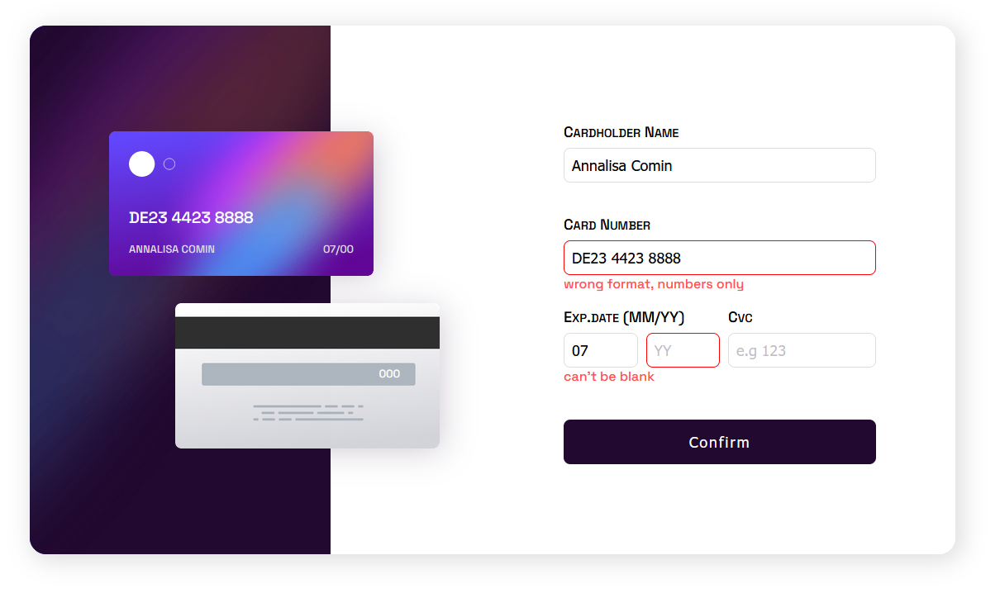
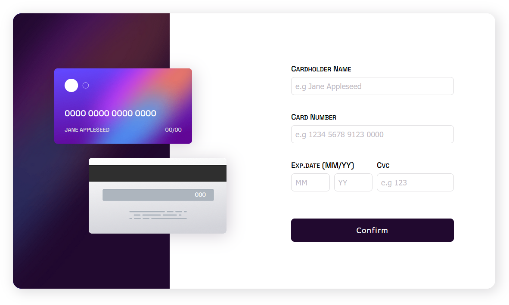
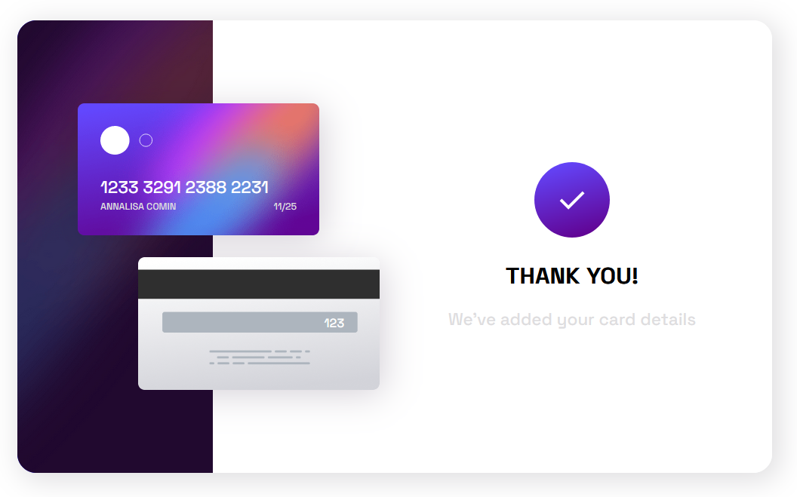
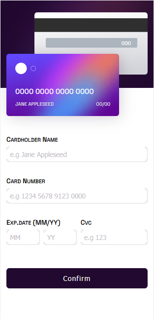

# Interactive card details form solution

This is a solution to the [Interactive card details form challenge on Frontend Mentor](https://www.frontendmentor.io/challenges/interactive-card-details-form-XpS8cKZDWw). Frontend Mentor challenges help you improve your coding skills by building realistic projects. 

## Table of contents

- [Overview](#overview)
  - [The challenge](#the-challenge)
  - [Screenshots](#screenshots)
  - [Links](#links)
- [My process](#my-process)
  - [Built with](#built-with)
  - [What I learned](#what-i-learned)
- [Author](#author)

## 📖 Overview

### The challenge

Replicate the [original design](./src/design) as precisely as possible.
Users should be able to:

- Fill in the form and see the card details update in real-time
- Receive error messages when the form is submitted if:
  - Any input field is empty
  - The card number, expiry date, or CVC fields are in the wrong format  
    <sub>Note: I enhanced it in the date and cvc fields so that useres can't type letters, so they are uncapable of having false input</sub>
- View the optimal layout depending on their device's screen size
- See hover, active, and focus states for interactive elements on the page
  
### Screenshots

<p style="vertical-align: top">



</p>
<p>
  
</p>

## ⚒️ My process

### Built with

- CSS Flexbox
- [React](https://reactjs.org/) - JS library
- [Next.js](https://nextjs.org/) - React framework
- [SCSS](https://sass-lang.com/) - CSS with superpowers
- [Typescript](https://www.typescriptlang.org/) - Types for JavaScript

### What I learned

I learned how to handle forms in react over multiple components and levels.  
Particularly, the react-hook-form library.

```tsx
  const form = useForm<FormData>({
    defaultValues: {
      name: '',
      cardNumber: '',
      expDate: { month: '', year: '' },
      cvc: '',
    },
    mode: 'onChange',
  });
  const { register, control, handleSubmit, formState, setValue } = form;
  const { errors } = formState;

  const name = useWatch({ name: 'name', control: control });
```
```jsx
<FormProvider {...form}>
  <InputField
  label='Card Number'
  placeholder='e.g. 1234 5678 9123 4567'
  maxLength={19}
  name='cardNumber'
  validation={validateCardNumber}
  formatInput={formatCardNumber}
  error={errors.cardNumber}
  />
</FormProvider>
```
And how to use validation and form data in form inputs.
```tsx
 const { register } = useFormContext();
  return (
    <div className={`input ${error?.message ? "error" : ""}`}>
      <label htmlFor={name}>{label}</label>
      <input
        type='text'
        placeholder={placeholder}
        maxLength={maxLength}
        {...register(name, {
          required: "Can't be blank",
          validate: (inputValue) => {
            if (validation && validation(inputValue)) {
              return "Wrong format, numbers only";
            }
          },
          onChange: (e) => {
            if (formatInput) formatInput(e.target.value);
          },
        })}
      />
      <p className='errorMsg'>{error?.message}</p>
    </div>
  );
```

## 👩‍💻 Author

Annalisa Comin

- [Instagram](https://www.instagram.com/annalisa_comin/)

